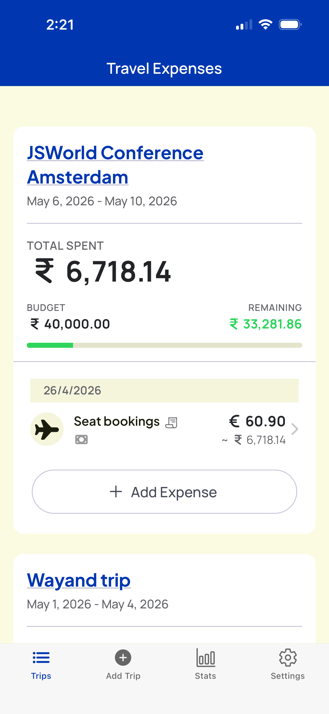
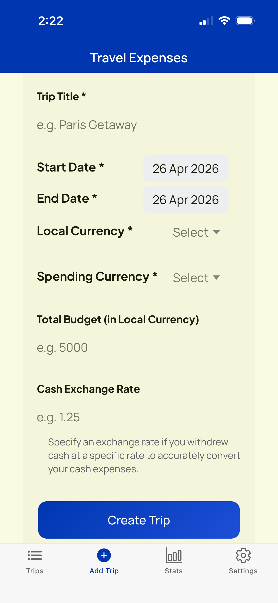
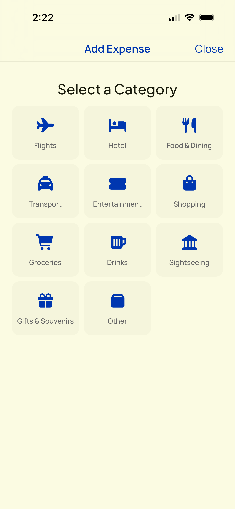
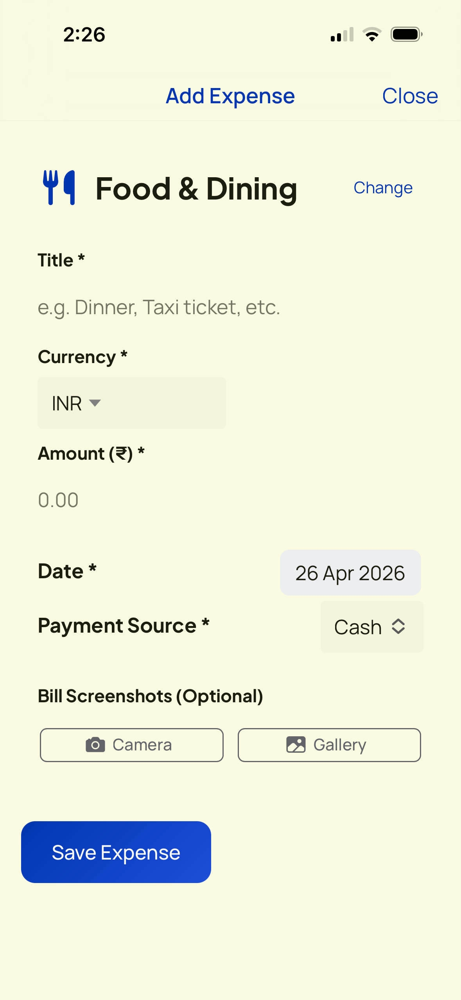
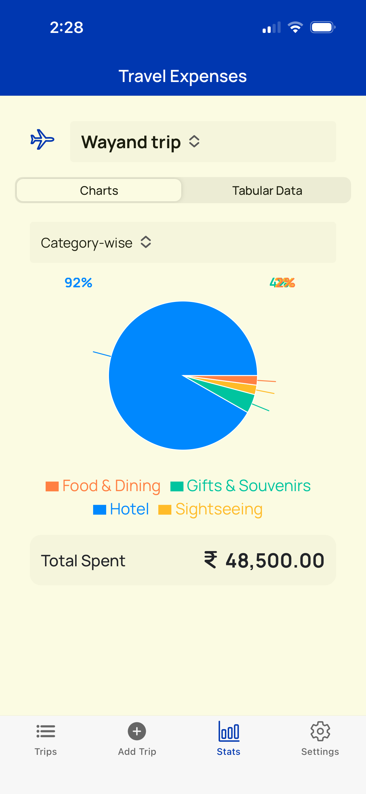
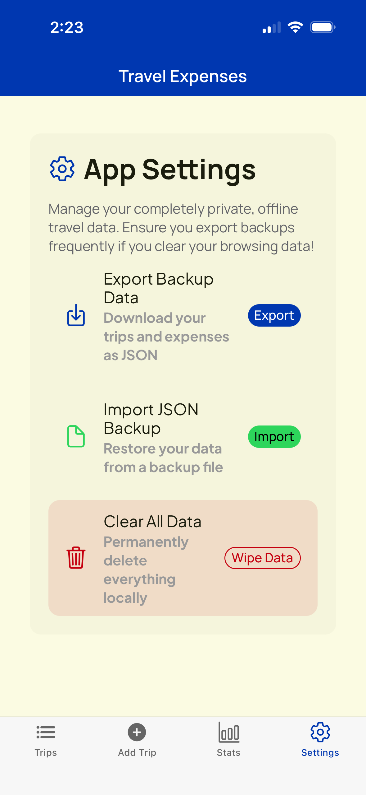

# Travel Expense Tracker

A beautifully designed, cross-platform mobile and web application for tracking your travel expenses on the go. 

Built seamlessly using **Google's Antigravity**, this application allows you to monitor your budget, manage multiple trips, and snap photos of your receipts—all fully offline and responsive.

## ✨ Features

- **Trip Management**: Create and manage multiple trips with custom start and end dates.
- **Budget Tracking**: Set a total budget for your trip and monitor your remaining funds dynamically.
- **Currency Intelligence**: Supports distinct local vs. spending currencies. Set custom cash exchange rates or rely on dynamic expense-level exchange calculations.
- **Expense Logging**: Easily log expenses categorized by type (Flights, Food, Transport, etc.) and source (Cash, Credit Card, etc.).
- **Receipt Attachments**: Take photos natively through your camera or upload from your gallery (supports image and PDF uploads) directly into the app. High-resolution images are automatically compressed using HTML5 Canvas APIs before storage.
- **Rich Analytics & Stats**: Visualize your spending habits through robust `Recharts` data visualization, complete with Category-wise and Day-wise distributions.
- **Offline First**: All your data is securely saved on your device using modern `localStorage`.
- **No Login Required**: Start tracking your expenses immediately. No accounts, no sign-ups, and complete privacy.

## 📸 App Screenshots








## 🛠 Technology Stack

This project was generated and bootstrapped utilizing modern web architecture and then wrapped into a native application.

- **Frameworks**: React 18, TypeScript, Vite
- **UI & Styling**: Ionic Framework (`@ionic/react`), Vanilla CSS, FontAwesome Icons, Ionicons
- **UI Generation**: Built with Google's Stitch
- **Data Visualization**: Recharts
- **Native Wrap**: Capacitor (iOS & Android)
- **AI Assist**: Google's Antigravity

## 🚀 Getting Started

Ensure you have Node.js and `npm` installed on your machine.

1. **Install Dependencies**
   ```bash
   npm install
   ```

2. **Run in Browser**
   To start the development server and test it in your web browser:
   ```bash
   npm run dev
   ```

3. **Build for Production**
   ```bash
   npm run build
   ```

## 📱 Running on Native Mobile

Because this app utilizes Capacitor, you can seamlessly deploy it to native mobile devices.

### Syncing the Web Build
Every time you build the web app (`npm run build`), you need to seamlessly copy the latest web assets to your native projects:
```bash
npx cap sync
```

### Running on iOS
To open the project in Xcode and run it on an iOS Simulator or your personal iPhone:
```bash
npx cap open ios
```
*Note: Make sure you use a valid Apple Developer provisioning profile to test on physical devices.*

### Running on Android
To open the project in Android Studio and run it on an Android Emulator or your personal Android device:
```bash
npx cap open android
```
